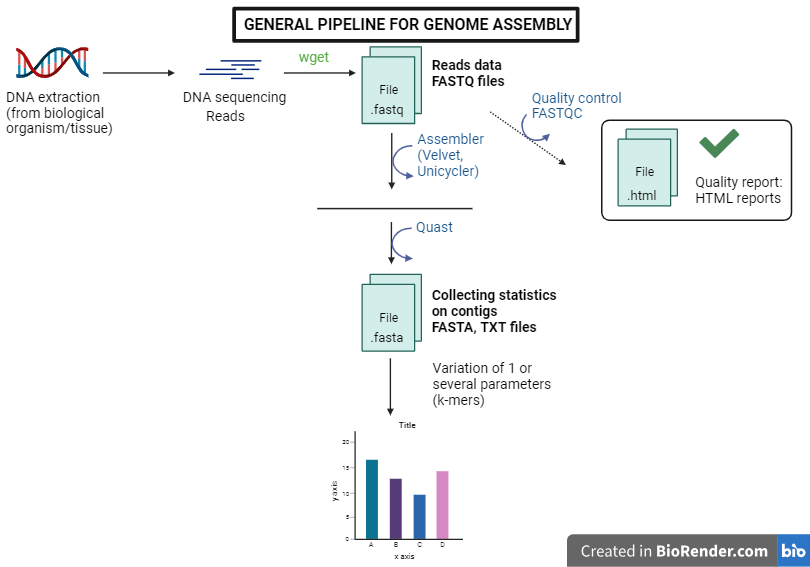

# Personal project in genome assembly

## Table of content
1. [Description](#descrp)
2. [Requirements](#req)
3. [Usage](#usage)
4. [Authors](#authors)
5. [References](#references)

<a name="descrp"></a>

## Description
The goal of this project is to learn about genome assembly. We consider both prokaryote and eukaryote genomes, use different assemblers, as Velvet or Unicycler, and compare them using literature and tutorials.

#### The pipeline is designed as follow:



<a name="req"></a> 

## Requirements

#### Install miniconda3: 

[Miniconda](https://docs.conda.io/en/latest/miniconda.html#linux-installers)

#### Install Miniforge3 for Linux:

[Miniforge3](https://github.com/conda-forge/miniforge?tab=readme-ov-file)

Then, close and re-open your terminal window and run ```which mamba``` to see if mamba is well installed.

#### Install your environment from a .yml file:

[Environment](https://conda.io/projects/conda/en/latest/user-guide/tasks/manage-environments.html#activating-an-environment)

Run ```mamba activate myenv.yml``` to install the environment.

<a name="usage"></a> 

## Usage

<a name="authors"></a> 

## Author
This project is developed by Chloé Aujoulat.

<a name="references"></a> 

## References

### Master thesis

- See link presented hereafter, filled in during the Master's thesis (Mittweida): https://docs.google.com/document/d/1qY48NFNB6xLzdDkWUJjfnFKcO7WQIyV5wA82bXYRPmQ/edit#heading=h.i9iemt2vcgr5 

### Tutorials
- Velvet:
    - Simon Gladman, An Introduction to Genome Assembly (Galaxy Training Materials). https://training.galaxyproject.org/training-material/topics/assembly/tutorials/general-introduction/tutorial.html Online; accessed Thu Sep 28 2023.
    - Hiltemann, Saskia, Rasche, Helena et al., 2023 Galaxy Training: A Powerful Framework for Teaching! PLOS Computational Biology 10.1371/journal.pcbi.1010752. 
    - Batut et al., 2018 Community-Driven Data Analysis Training for Biology Cell Systems 10.1016/j.cels.2018.05.012.
    - https://www.animalgenome.org/bioinfo/resources/manuals/velvet.pdf
    - Manual Velvet: https://github.com/dzerbino/velvet/blob/master/Manual.pdf
- Unicycler: 
    - Anton Nekrutenko, Delphine Lariviere, Simon Gladman, Unicycler Assembly (Galaxy Training Materials). https://training.galaxyproject.org/training-material/topics/assembly/tutorials/unicycler-assembly/tutorial.html Online; accessed Wed Jan 17 2024
    - Hiltemann, Saskia, Rasche, Helena et al., 2023 Galaxy Training: A Powerful Framework for Teaching! PLOS Computational Biology 10.1371/journal.pcbi.1010752
    - Batut et al., 2018 Community-Driven Data Analysis Training for Biology Cell Systems 10.1016/j.cels.2018.05.012
- Coverage: 
    - https://bedtools.readthedocs.io/en/latest/content/tools/coverage.html 


### Articles
- Dominguez Del Angel, Victoria, Erik Hjerde, Lieven Sterck, Salvadors Capella-Gutierrez, Cederic Notredame, Olga Vinnere Pettersson, Joelle Amselem, et al. « Ten Steps to Get Started in Genome Assembly and Annotation ». F1000Research 7 (2018): ELIXIR-148. https://doi.org/10.12688/f1000research.13598.1.
- Wick, Ryan R., Louise M. Judd, Claire L. Gorrie, et Kathryn E. Holt. « Unicycler: Resolving Bacterial Genome Assemblies from Short and Long Sequencing Reads ». PLOS Computational Biology 13, nᵒ 6 (8 juin 2017): e1005595. https://doi.org/10.1371/journal.pcbi.1005595.
- Zerbino, Daniel R., and Ewan Birney. « Velvet: Algorithms for de novo short read assembly using de Bruijn graphs ». Genome Research 18, nᵒ 5 (mai 2008): 821‑29. https://doi.org/10.1101/gr.074492.107.
- Douglass, A. P., O’Brien, C. E., Offei, B., Coughlan, A. Y., Ortiz-Merino, R. A., Butler, G., ... & Wolfe, K. H. (2019). Coverage-versus-length plots, a simple quality control step for de novo yeast genome sequence assemblies. G3: Genes, Genomes, Genetics, 9(3), 879-887. https://doi.org/10.1534/g3.118.200745 
- David Sims, Ian Sudbery, Nicholas E. Ilott, Andreas Heger & Chris P. Ponting. Sequencing depth and coverage: key considerations in genomic analyses. Nature reviews genetics. 15, pages121–132 (2014).

