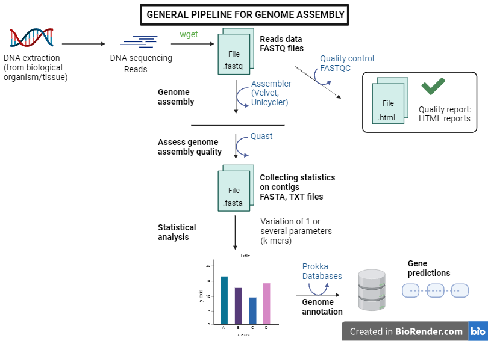

# Personal project in genome assembly

## Table of content
1. [Description](#descrp)
2. [Requirements](#req)
3. [Usage](#usage)
4. [Authors](#authors)
5. [References](#references)

## Description
The goal of this project is to learn about genome assembly. We consider both prokaryote and eukaryote genomes, use different assemblers, as Velvet or Unicycler, and compare them using literature and tutorials.

#### The pipeline is designed as follow:

 

## Requirements

#### Install miniconda3: 

[Miniconda](https://docs.conda.io/en/latest/miniconda.html#linux-installers)

 

## Usage

 

## Author
This project is developed by Chloé Aujoulat.

 

## References

### Tutorials
- Velvet:
    - Simon Gladman, An Introduction to Genome Assembly (Galaxy Training Materials). https://training.galaxyproject.org/training-material/topics/assembly/tutorials/general-introduction/tutorial.html Online; accessed Thu Sep 28 2023.
    - Hiltemann, Saskia, Rasche, Helena et al., 2023 Galaxy Training: A Powerful Framework for Teaching! PLOS Computational Biology 10.1371/journal.pcbi.1010752. 
    - Batut et al., 2018 Community-Driven Data Analysis Training for Biology Cell Systems 10.1016/j.cels.2018.05.012. 

### Articles
- Dominguez Del Angel, Victoria, Erik Hjerde, Lieven Sterck, Salvadors Capella-Gutierrez, Cederic Notredame, Olga Vinnere Pettersson, Joelle Amselem, et al. « Ten Steps to Get Started in Genome Assembly and Annotation ». F1000Research 7 (2018): ELIXIR-148. https://doi.org/10.12688/f1000research.13598.1.
- Wick, Ryan R., Louise M. Judd, Claire L. Gorrie, et Kathryn E. Holt. « Unicycler: Resolving Bacterial Genome Assemblies from Short and Long Sequencing Reads ». PLOS Computational Biology 13, nᵒ 6 (8 juin 2017): e1005595. https://doi.org/10.1371/journal.pcbi.1005595.
- Zerbino, Daniel R., et Ewan Birney. « Velvet: Algorithms for de novo short read assembly using de Bruijn graphs ». Genome Research 18, nᵒ 5 (mai 2008): 821‑29. https://doi.org/10.1101/gr.074492.107.

### PDF files
- https://www.animalgenome.org/bioinfo/resources/manuals/velvet.pdf
- Manual Velvet: https://github.com/dzerbino/velvet/blob/master/Manual.pdf 

